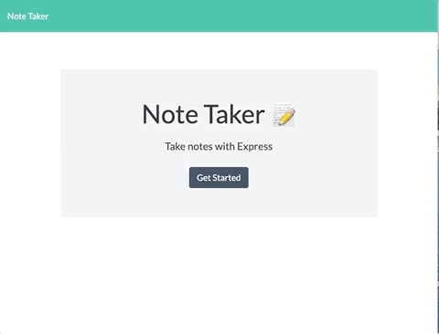
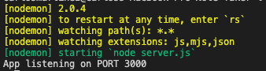
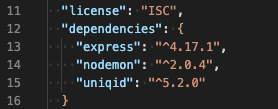

# Note-Taker
An application that can be used to write, save, and delete notes using an express backend, saving and retrieving note data from a JSON file.

[](https://bwaycarl.github.io/Portfolio/)
[](https://github.com/BwayCarl/Note-Taker/blob/master/LICENSE)
[](https://github.com/BwayCarl/Note-Taker/issues)
[](https://github.com/BwayCarl/Note-Taker/network)
[](https://github.com/BwayCarl/Note-Taker/stargazers)

## Homework Assignment - Week 11
#### Rutgers Coding Bootcamp / RUT-JER-FSF-PT-06-2020-U-C

## *Table of Contents*
- [Description](#description)
 - [Installation](#installation)
 - [Usage](#usage)
 - [Contributing](#contributing)
 - [Authors](#authors)
 - [Screenshots](#screenshots)
 - [Application](#application)
 - [Tests](#tests)
 - [Contact Me](#contact-me)
 - [License](#license)

## *Description* 
This application builds a Node Command Line Interface using an express backend that can be used to create and store notes to a JSON file. Once saved, the title of the note is generated on a list. Clicking on the title will recall the note in a readonly format. Each note has a unique ID generated when the note is saved in order for easy deletion of a specific note.

## *Installation* 
Clone the Github repo.
```https://github.com/BwayCarl/Note-Taker.git```

Once in the properly cloned folder, run ```npm install``` to install the following dependencies:
 * Express:  ```npm i express``` to use Express.js in your command line.
 * Uniqid:  ```npm i uniqid``` to add a unique ID for each note created.
 * Nodemon:  ```npm i nodemon``` to have your server automatically reload after changes are made in the code files.

## *Usage*

 #### **LOCAL USAGE:** 
 Enter ```nodemon server.js``` in your command line and press ```ENTER```. 
 After receiving the notification ```App listening on PORT 3000```, open your browser and use ```http://localhost:3000``` to access the Note Taker App. 
#### **USE IN BROWSER:**
You can also use this app directly from the [deployed Heroku site](https://afternoon-dawn-02847.herokuapp.com/).

## *Contributing* 
 Please contact me to contribute.

## *Authors* 
 Carlos Martinez

 Frontend, templates and ```index.js``` file provided by Rutgers as a starting point for the assignment.

## *Screenshots* 






 ## *Application*

### :rocket: Live application [deployed on Heroku.](https://afternoon-dawn-02847.herokuapp.com/)

## *Tests*
 No tests specified.

## *Contact Me*
 - Github: **[BwayCarl](https://github.com/BwayCarl)**
 - LinkedIn: **[Carlos Martinez](https://www.linkedin.com/in/carlos-martinez-8702b146/)** 
 - Twitter: **[@BwayCarlDev](https://twitter.com/BwayDev)**
 - Email: **[bwaycarl@gmail.com](mailto:bwaycarl@gmail.com)**

## *License* 
This project is [MIT](https://github.com/BwayCarl/Note-Taker/blob/master/LICENSE) Licensed.
 
 &copy; 2020, Carlos Martinez

